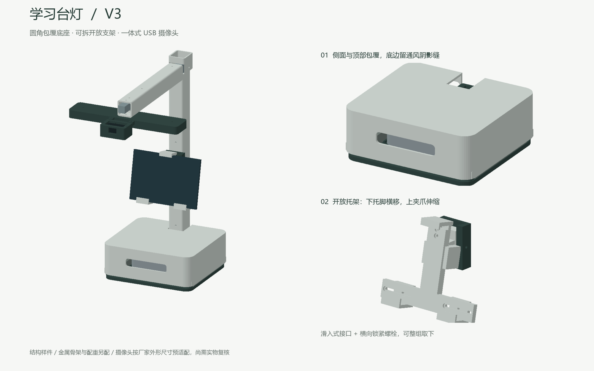

# Smart Study Lamp / 学习台灯 V3

一套可用于 3D 打印打样的学习台灯结构模型。底座容纳 Mac mini M4，灯柱内可走线，并带有可拆屏幕支架和绿联 USB 摄像头安装模块。



## 当前设计

- 圆角包覆式底座，侧面和顶部遮蔽 Mac mini，底部保留进风空间。
- 20 × 20 × 1.5 mm 钢方管承重骨架；打印件只承担外壳、定位和连接作用。
- 可拆开放式屏幕支架，目标夹持高度 130–220 mm。
- 摄像头安装腔按不含底座的 59 × 35 × 23 mm 机身设计。
- 灯柱与横臂内预留线束通道，并给屏幕、LED 和摄像头设置出线口。
- 灯头预留通用 LED 铝槽容纳空间；灯条、铝槽、扩散罩、调光器和电源尚未选定。

## 查看模型

- `assembly_view_only.glb`：完整装配预览，包含设备和金属骨架占位，不可整体打印。
- `stl/`：18 个独立打印文件，单位均为毫米。
- `renders/`：整灯与拆装渲染图。

Windows 可直接尝试打开 GLB；也可使用 Blender。查看和切片 STL 可以使用 [Bambu Studio](https://bambulab.cn/zh-cn/download/studio)。

## 打印前必读

这是结构样件，还未进行实物承重、防倾倒、温升、照度、眩光和摄像头覆盖范围测试。建议先打印 16–18 号配合试片，以及 09/10 号摄像头适配件。

完整尺寸、采购参考和装配顺序见：

- [设计与打印说明](docs/设计与打印说明.md)
- [V3 更新与走线说明](docs/V3更新与走线说明.md)

## 重新生成模型

建模源文件位于 `model/build_lamp_v3.py`。安装依赖后，在仓库根目录运行：

```powershell
python -m pip install -r requirements.txt
python model/build_lamp_v3.py
```

脚本会在 `outputs/V3` 下重新生成 STL、预览图和校验结果。中文标注渲染目前会优先使用 Windows 的微软雅黑字体。

## 版本状态

V3 已完成数字几何检查：18 个 STL 均为封闭、正体积、单一连通网格；打印件、设备包络和预留线束探针没有检测到体积干涉。数字检查不能替代实物装配和安全测试。

本仓库暂未声明开源许可证；未经许可，不自动授予复制、修改或再发布权利。
